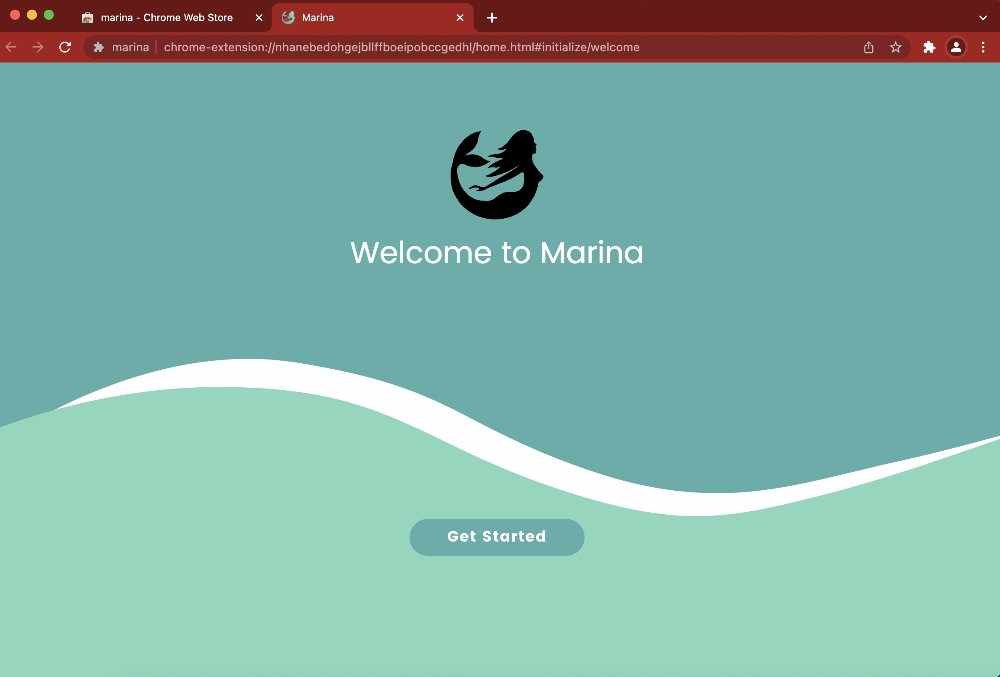
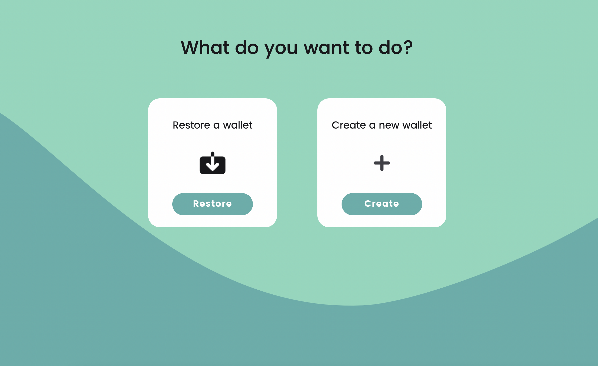
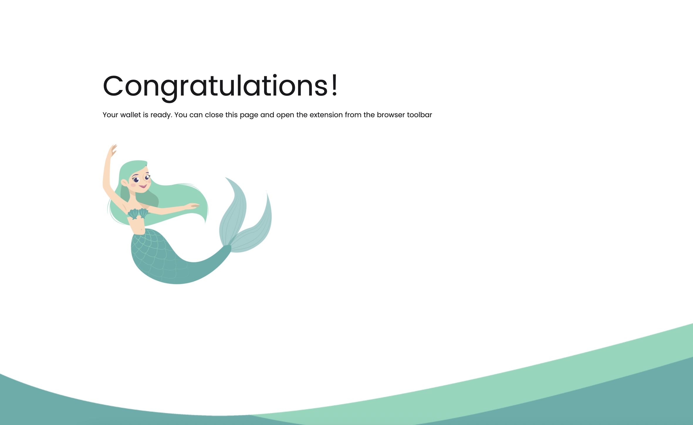
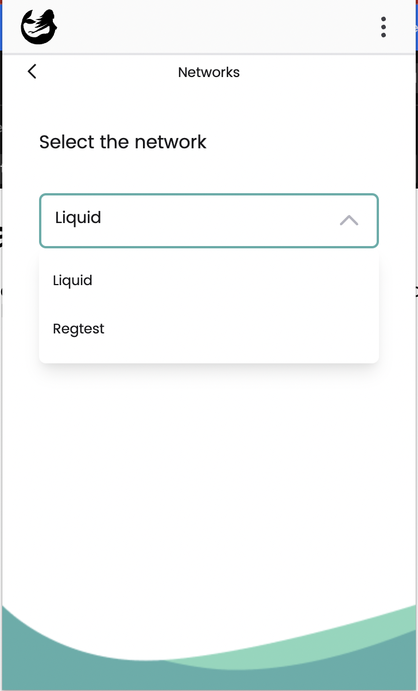

# 🌊 building-on-liquid
links and material to build on Liquid with Nigiri CLI and Marina Wallet 


## Overview

### Main features

- Signed blocks/proof of authority
- 1 BTC = 1 L-BTC
- Confidential transactions
- Native asset issuance
- 1 minute block-time, 2 min finality
- Atomic Swaps
- Bitcoin Script with 🚀🚀🚀 (ie. Covenants)
  - Bitcoin contracts
    - WHO: Public/Private key, Multi Signature
    - WHEN: Timelock

  - Liquid contracts
    - WHERE and HOW
      - Over-collateralized loans
      - Synthetic Asset/Derivatives
      - Vaults with Emergency Keys
      - Oracle redemption 

### Links

- [Elements project](https://elementsproject.org/)
- [Blockstream Help Center](https://help.blockstream.com/hc/en-us/categories/900000056143-Liquid-Network/)
- [Elements Core repo](https://github.com/elementsproject/elements)


# 🔨Workshop

## 🍣 Nigiri


Nigiri provides a command line interface that manages a selection of docker-compose batteries included to have ready-to-use bitcoin **regtest** development environment, with a bitcoin node, electrum explorer both backend and frontend user interface.

It offers a JSON HTTP proxy passtrough, called 🥢[Nigiri Chopsticks](https://github.com/vulpemventures/nigiri-chopsticks) that adds to the explorer handy endpoints like /faucet and /mint with automatic block generation.

You can have Elements too with the --liquid flag.

Are you looking to spin-up Nigiri Github Action? Look [here](https://github.com/vulpemventures/nigiri-github-action)
https://nigiri.vulpem.com


### 🛵 Let's go

1. Install (Linux or Mac, requires Docker)

```bash
curl https://getnigiri.vulpem.com | bash
```

2. Start Bitcoin & Liquid box

```bash
nigiri start --liquid
```

You can check Liquid Esplora running on [http://localhost:5000](http://localhost:5001)

3. Send some L-BTC (to ourself)

```bash
nigiri faucet --liquid `nigiri rpc --liquid getnewaddress`
```

4. Mint 100 tokens 🤑

```bash
nigiri mint `nigiri rpc --liquid getnewaddress` 100 "My Token" "TKN"
```


---

## 🧜‍♀️ Marina


Marina is a browser extension designed to streamline access to Liquid and foster an even greater adoption of the network. It enables users to easily send and receive Liquid assets such as Liquid Bitcoin (L-BTC) and Tether USDt. Web developers can benefit from Marina integration as a plug-and-play solution to integrate Liquid Network into their browser applications.


🤓 The code  is available on Github
https://github.com/vulpemventures/marina

👩‍💻 You can integrate the Marina Web Provider in your website to give your users access to the Liquid Network
https://docs.vulpem.com/marina/introduction

👀 Privacy Policy
https://sites.google.com/vulpem.com/marina-wallet-privacy-policy


### More about

- You can find the latest version of Marina on our [website](https://vulpem.com/marina).
- For help using Marina, [join our Telegram channel](https://t.me/marina_wallet).
- To report bugs or make feature request [open an issue on the Github repository](https://github.com/vulpemventures/marina/issues/new).
- To stay in touch [follow us on Twitter](https://twitter.com/MarinaWallet)


### 👩‍🔧 Onboarding

1. Install on Chrome/Chromium

https://chrome.google.com/webstore/detail/marina/nhanebedohgejbllffboeipobccgedhl

2. Click on Get Started



3. Create new wallet




4. Choose Password & Confirm the mnemonic (or remind later)

5. 🎉🎉🎉




6. Switch to Regtest (and connect to Nigiri)

Go to `Settings` > `Networks` > Select `Regtest` from dropdown



> Ignore the message `Unknown error`


### Send some funds

1. Get a new address clicking on `Receive`

2. Send 0.1 L-BTC

```bash
nigiri faucet --liquid <marina_address> 0.1
```
3. Get asset ID(s) 

```
nigiri rpc --liquid getbalance
```

4. Send 25 tokens

```bash
nigiri faucet --liquid <marina_address> 25 <asset_hash>
```


### 👩‍🔧 Write our first Liquid web app!

Create an `index.html` file and open with your browser

```html
<!DOCTYPE html>
<html>
  <head>
    <title>Marina App</title>
    <meta charset="UTF-8" />
    <script>
      async function showBalances() {
        const div = document.getElementById("balance");
        const balances = await window.marina.getBalances();
        balances.forEach((balance, index) => {
          asset = document.createElement("p");
          asset.textContent = balance.asset.ticker;
          div.appendChild(asset);

          amount = document.createElement("p");
          amount.textContent = balance.amount;
          asset.appendChild(amount);

          separator = document.createElement("hr");
          amount.appendChild(separator);
        });
      }
    </script>
  </head>

  <body>
    <button
      onclick="(async function () {
				 
				 // detect user permission and display balances
				 window.marina.on('ENABLED', showBalances);

					// prompt user to enable
        	await window.marina.enable();
      })();"
    >
      Connect
    </button>

    <button
      onclick="(async function () {
        await window.marina.disable();
      })();"
    >
      Disconnect
    </button>

    <hr />

    <h1>My Watch-Only Liquid Wallet</h1>
    <br />

    <div id="balance">
      <h2>Balance</h2>
    </div>
  </body>
</html>

```


